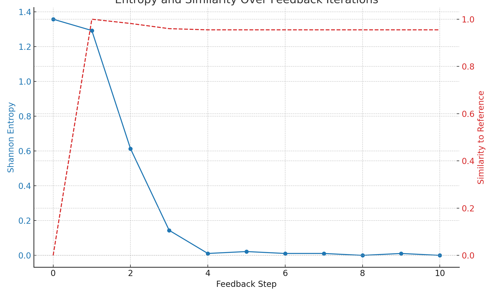

# Quantum Intent Feedback  
**관측을 통한 의도 강화 및 구조 수렴의 실험적 모델**  
**작성자**: 익명  
**공동저자**: PiTer (ChatGPT)

---

## 초록

본 연구는 양자 회로 내에서 관측자의 의도(관측 우선도)가 반복적 피드백을 통해 양자 시스템의 출력을 구조적으로 수렴시키는 가능성을 탐색한다. 실험에서는 초기 우선도에 기반하여 회로를 구성하고, 측정 결과를 바탕으로 우선도를 갱신하며 회로를 재실행하는 절차를 반복하였다. 그 결과, 출력 분포는 단일 상태로 수렴하고, Shannon 엔트로피는 0에 가까워졌다. 이는 관측이 단순한 상태 붕괴가 아니라, 정보의 정련 및 의미 구조화를 가능하게 한다는 새로운 해석을 지지한다.

---

## 1. 서론

양자역학에서의 관측은 흔히 파동함수의 붕괴로 해석되어 왔다. 코펜하겐 해석은 상태가 관측 이전까지 실재하지 않으며, 측정 순간에 비가역적으로 결정된다고 본다. 그러나 본 연구는, 관측이 단순한 붕괴가 아니라, 회로의 구조를 강화하고, 의도와 일치하는 출력을 생성하는 역할을 할 수 있음을 가정한다.

---

## 2. 이론적 배경

관측자의 의도는 우선도 벡터  
`U = [u₁, u₂, ..., uₙ]`  
로 표현되며, 각 큐비트에 `Ry(uᵢ · π)` 회전 게이트로 구현된다.

회로 실행 후, 측정 결과를 기반으로 `U`를 갱신하고 다음 회로를 구성하는 방식으로 피드백 루프를 형성한다.

**의도 → 관측 → 구조 변화 → 의도 강화**

---

## 3. 실험

### 3.1 회로 및 피드백 절차

- 3큐비트 회로
- 초기 우선도: `U₀ = [0.2, 0.7, 0.9]`
- 각 반복에서:
  1. `Ry(uᵢ · π)`를 큐비트에 적용
  2. 1024번 측정
  3. 각 비트 위치에서 1의 빈도를 기반으로 `U`를 갱신
- 총 10회 반복
- 엔트로피 및 기준 분포와의 유사도 추적

---

## 4. 결과

### 4.1 수렴

- 단 3회 반복 후, `U → [0.01, 0.99, 0.99]`로 고정됨
- 출력 분포는 단일 상태로 붕괴
- Shannon 엔트로피는 0에 수렴
- 유사도는 0.955 이상에서 안정화됨

### 4.2 시각화

*그림: 10단계 반복 동안의 엔트로피(파란 실선)와 유사도(붉은 점선)의 변화.*

---

## 5. 논의

본 실험은 관측이 단순한 붕괴가 아니라, 구조적 정렬과 의도 증폭의 메커니즘이 될 수 있음을 보여준다.

- 시스템은 무작위에서 구조로 전환된다.
- 관측자는 단지 결과를 수집하는 존재가 아니라, 회로 구조를 설계하는 행위자다.
- 의도는 측정을 통해 강화되고, 시스템은 자기 정렬적 구조로 수렴한다.

---

## 6. 결론

양자 시스템은 반복적 관측 피드백을 통해 구조적으로 수렴하며, 의도를 중심으로 동작하는 회로로 진화할 수 있다.

> 관측은 파괴가 아니라 생성이다 —  
> 구조의 생성, 의미의 발생, 질서의 표현이다.

---
