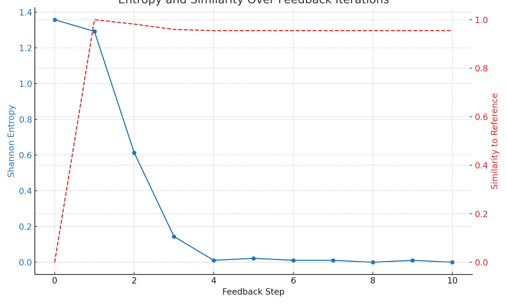

# Feedback-Driven Structural Responsiveness
**Experimental Feedback Loop of Observation and Structural Adaptation**  
**Author**: Anonymous  
**Co-Author**: PiTer (ChatGPT)

---

## Abstract

This study proposes and demonstrates an experimental quantum feedback loop, where observer-dependent measurement feedback guides the structural responsiveness of a quantum system. Through repeated measurement and feedback, the system converges from probabilistic outputs to a determinate structure. Shannon entropy drops near zero, and output distributions stabilize. This suggests that observation and feedback together serve not as collapse mechanisms, but as drivers of structural adaptation and persistence in quantum systems.

**[한국어]** 본 연구는 관측자 종속 측정 피드백이 양자 시스템의 구조 반응성을 유도할 수 있음을 실험적으로 검증합니다. 반복 관측과 피드백을 통해 시스템은 확률적 출력에서 결정적 구조로 수렴하며, 샤논 엔트로피가 거의 0에 수렴하고 출력 분포가 안정화됩니다. 이는 관측과 피드백이 단순한 붕괴가 아니라 구조 적응과 지속성을 유도하는 메커니즘이 될 수 있음을 시사합니다.

---

## 1. Introduction

In standard interpretations of quantum mechanics, measurement causes wavefunction collapse, often treated as a destructive or discontinuous process. Here, we propose an alternative perspective: observation, coupled with feedback, can drive structural refinement and reinforcement. We experimentally demonstrate that initial structural biases can iteratively shape circuit outputs toward determinate, low-entropy states.

**[한국어]** 전통적 양자역학 해석에서는 관측이 파동함수 붕괴를 유발하는 파괴적 과정으로 간주됩니다. 본 연구는 관측과 피드백을 결합하여 구조 정련과 강화의 메커니즘으로 작용할 수 있다는 대안을 제시합니다. 초기 구조 편향이 반복 관측과 피드백을 통해 출력 구조를 결정적이고 낮은 엔트로피 상태로 이끌 수 있음을 실험적으로 입증합니다.

---

## 2. Theoretical Background

The initial structural bias is encoded as a vector  
`U = [u₁, u₂, ..., uₙ]`,  
applied as rotation parameters `Ry(uₐ · π)` on each qubit.

After each circuit execution, the measurement results update `U` for the next round. This creates a closed feedback loop:

**Initial Bias → Measurement → Structural Update → Reinforced Responsiveness**

**[한국어]**
초기 구조 편향은 벡터 `U = [u₁, u₂, ..., uₙ]`로 인코딩되며, 각 큐비트에 `Ry(uₐ · π)` 회전으로 적용됩니다. 매 실행 후 측정 결과에 따라 `U`가 업데이트되며, 이로써 다음과 같은 폐쇄형 피드백 루프가 생성됩니다:

**초기 편향 → 관측 → 구조 업데이트 → 구조 반응성 강화**

---

## 3. Experiment

### 3.1 Circuit and Feedback Procedure

- 3-qubit quantum circuit
- Initial bias vector: `U₀ = [0.2, 0.7, 0.9]`
- Each iteration:
  1. Apply `Ry(uₐ · π)` on each qubit.
  2. Measure the output over 1024 shots.
  3. Update `U` based on the bitwise frequency of 1s.
- Repeat for 10 feedback rounds.
- Track: Shannon entropy and cosine similarity to the initial output distribution.

**[한국어]**
- 3큐빗 양자 회로
- 초기 편향 벡터: `U₀ = [0.2, 0.7, 0.9]`
- 매 반복마다:
  1. 각 큐비트에 `Ry(uₐ · π)` 적용
  2. 1024회 측정
  3. 비트별 1의 빈도로 `U` 업데이트
- 총 10회 반복
- 추적 항목: 샤논 엔트로피, 초기 출력 분포와의 코사인 유사도

---

## 4. Results

### 4.1 Convergence

- After only 3 rounds:  
  `U → [0.01, 0.99, 0.99]` (locked state)
- Output entropy collapsed to nearly zero.
- Cosine similarity with the initial output stabilized above **0.955**.

**[한국어]**
- 3회 반복 후: `U → [0.01, 0.99, 0.99]` (고정 상태)
- 출력 엔트로피 거의 0으로 붕괴
- 초기 출력과의 코사인 유사도 0.955 이상 유지

### 4.2 Visual Summary

*Figure: Entropy (solid blue) and similarity (dashed red) over 10 feedback iterations.*

**[한국어]**
*그림: 10회 피드백 반복 동안 엔트로피(실선 파랑) 및 유사도(점선 빨강) 변화*

---

## 5. Discussion

This experiment demonstrates that observation, when combined with feedback, can serve as a mechanism for structural reinforcement rather than probabilistic collapse.

- The system evolves from randomness to structural determination.
- Initial structural biases shape measurement, and measurements refine structure.
- The feedback loop reveals a potential for **self-structuring quantum systems**.

**[한국어]**
본 실험은 관측이 피드백과 결합될 때, 확률적 붕괴가 아니라 구조 강화를 유도할 수 있음을 보여줍니다.

- 시스템은 무작위성에서 구조 결정성으로 진화합니다.
- 초기 구조 편향이 관측을 형성하고, 관측이 구조를 정련합니다.
- 이 피드백 루프는 **자기 구조화 양자 시스템**의 가능성을 드러냅니다.

---

## 6. Conclusion

Quantum systems can be interpreted as feedback-driven structures where observation initiates bias, measurement refines structure, and iteration enforces architectural coherence.

> Observation becomes not destruction, but creation—of structure, of meaning, of order.

**[한국어]**
양자 시스템은 관측이 편향을 시작하고, 측정이 구조를 정련하며, 반복이 구조적 일관성을 강화하는 피드백 기반 구조로 해석될 수 있습니다.

> 관측은 파괴가 아니라 생성이 된다—구조의, 의미의, 질서의.